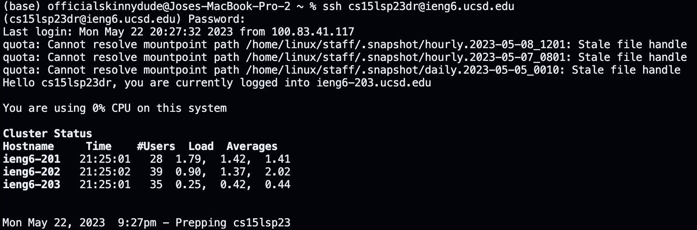
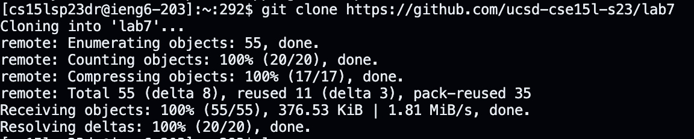
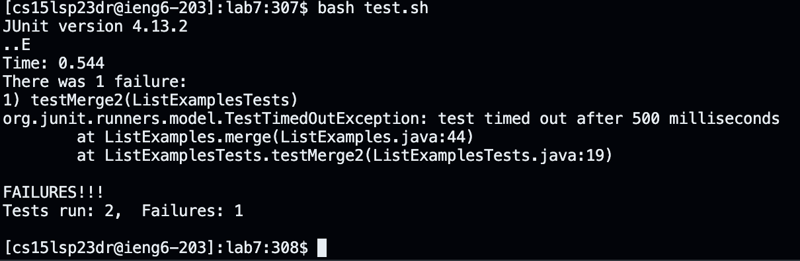
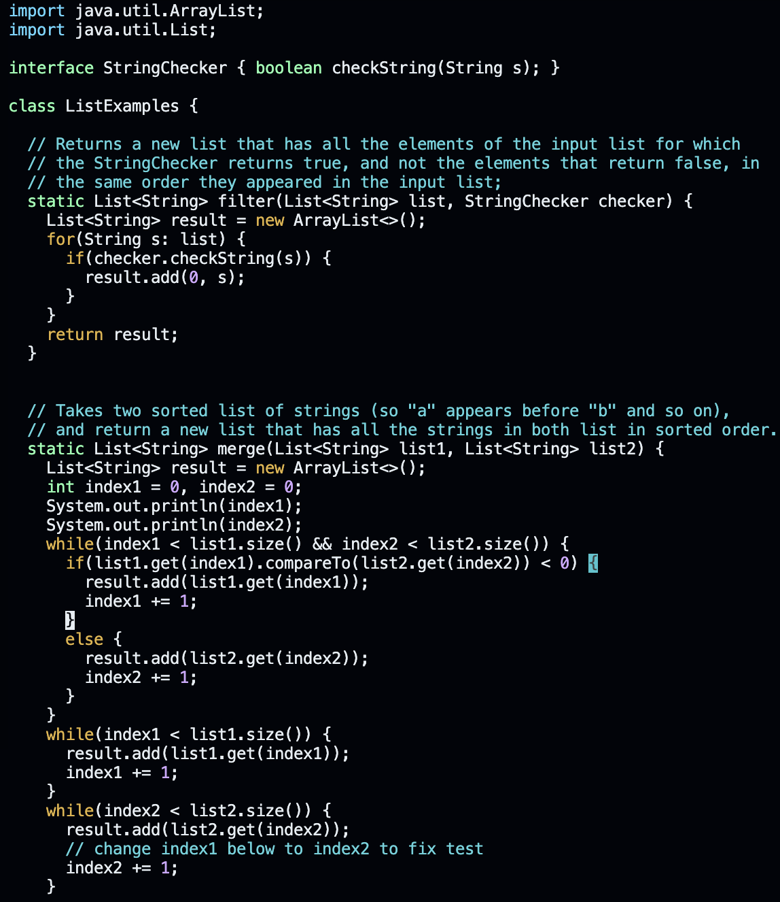

# Using Vim to Fix Files
# My First Run
My first run was rough. After taking the vim tutor, I was excited to edit and write code while using Vim. Let me tell you that using Vim is tricky. I did steps 1-9 from the lab write-up and it took me 21 minutes and 14 seconds to figure out Vim and edit the files. My timing is embarassing but I feel that for the my second run, I will be able to cut it by half since I already know what to do. Because I was strugglign with what keys to press and trying to edit the file, I didn't bother to record my keystrokes as it would be way too many keystrokes. I can, however, paint a picture of why I took so long. 

**Moving Around**

Moving around was really confusing. I was confusing `j` with `h` because I kept thinking that `j` was the left button, but it just kept taking me down the file. It was annoying but I eventually got used to the navigation.

**Moving Around While Insterting**

This was even more frustrating because I kept pressing different letters and ended up doing different modifactions to the file. The good thing was that this was easy to get use to, as to edit a file you only press one letter like `i` to insert text or `x` to delete. Now that I think about it, I could use `dw` to get rid of a word. That could save me time and keystrokes. 

**Conclusion**

Using Vim was a little difficult at first, but was fun to learn. I have been looking forward to see what Vim is about, since I know it is a topic in the coomputer science community. I have seen so many memes about Vim and how it is annoying to use. Now that I have a little bit of Vim experience, I can somewhat relate to the memes. At least I can close Vim, at least I hope so...

# The Second Run
The Second run was way better than my first run. My time was 6 minutes and 42 seconds. Now that is a time difference. 
**Improvements**
The biggest improvement here was the navigation. I was not confusing `h` with `j` and I also found out that you can you use your actual cursor to move around. Hopefully that isn't cheating. I also used shortcuts like `dw` to remove words miuch quicker and use less keystrokes. That is pretty much how I imrpoved. Maybe I should go for less keystrokes and do it in 5 minutes.

**Keystrokes**
I would like to thank my friend for taking the time to record my keystrokes. 

`<up> <enter> `  I used the bash history to log into my ieng6 account

`<ctrl c> <ctrl v> <enter>` To git clone the files

`ls` `cd lab7` <enter>`

`ls` `vim ListExamples.java <enter>`

`dd` `u` I confused `dd` with `dw` so I press undo
  
`dw` on sc, `I checker` This was done twice on the code

`I <enter>` to make a new line and then `System.out.println(Index1)` this was done twice for Index 1 and Index 2
  
`<esc> I 2` This was used to change index1 to index2
  
`<shift> wq! <enter>` To save files
 
`bash test.sh`

**Pictures of the Process**
  

  

  

  

  
  

  
 

